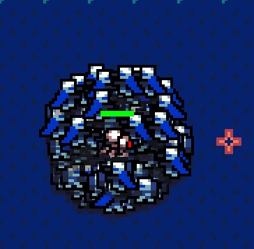
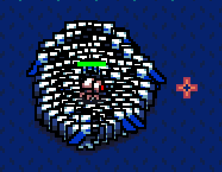

`extol_sprite_layer` lets you specify the drawing order for sprites in your [Bevy](https://bevyengine.org/) game using a separate component rather than via the z-coordinate of your transforms.

## Motivation

When making a 2D game in [bevy](https://bevyengine.org/), the z-coordinate is essentially used as a layer index: things with a higher z-coordinate are rendered on top of things with a lower z-coordinate. This works, but it has a few problems:

The z-coordinate isn't relevant for things like distance or normalization. The following code is subtly wrong:

```rust
use bevy::prelude::*;

/// Get a unit vector pointing from the position of `source` to `target`, or zero if they're close.
fn get_normal_direction(query: Query<&GlobalTransform>, source: Entity, target: Entity) -> Vec2 {
  let from_pos = query.get(source).unwrap().translation();
  let to_pos = query.get(target).unwrap().translation();
  (from_pos - to_pos).normalize_or_zero().truncate()
}  
```

The bug is that we normalize *before* truncating, so the z-coordinate still 'counts' for purposes of length. So if the source is at `(0, 0, 0)` and the target is at `(0, 1, 100)`, then we'll return `(0, 0.001)`!
 
If you have entities that are children of other entities, the parent's transform propagates to the child. Sometimes this is what you want, but if it isn't, it leads to things being on the completely wrong layer.

Entities on the same layer are drawn in an effectively arbitrary order that can change between frames. If your game can have entities on the same layer overlap with each other, this means entities will 'flip-flop' back and forth. This is distracting. The usual solution is *y-sorting*, where entities on the same layer are sorted by their y-coordinate, so enemies lower on the screen are drawn on top. Here's an example from my WIP game [tengoku](https://codeberg.org/ext0l/tengoku), which is what led me to develop this crate. In both images, all the enemies (the blue 'soldiers') are on the same layer. In the first one, enemies are drawn roughly in spawn order, which makes the pile appear disorganized and unnatural. The second is y-sorted, resulting in a much cleaner-looking pile. (The red robot in the center, representing the player, is on a higher layer in both cases.)




## How to use

```rust
use bevy::prelude::*;
use extol_sprite_layer::{LayerIndex, SpriteLayerPlugin};

#[derive(Debug, Copy, Clone, Component, PartialEq, Eq, Hash)]
enum SpriteLayer {
    Background,
    Object,
    Enemy,
    Player,
    Ui,
}

impl LayerIndex for SpriteLayer {
    fn as_z_coordinate(&self) -> f32 {
        use SpriteLayer::*;
        match *self {
            // Note that the z-coordinates must be at least 1 apart...
            Background => 0.,
            Object => 1.,
            Enemy => 2.,
            // ... but can be more than that.
            Player => 990.,
            Ui => 995.
        }
    }
}

let mut app = App::new();
// Then, add the plugin to your app.
app.add_plugin(SpriteLayerPlugin::<SpriteLayer>::default());
```
